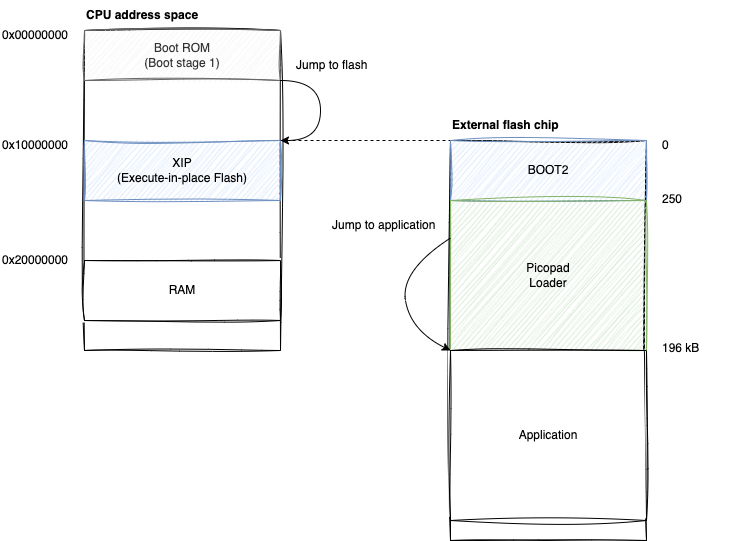

# Alternative Loader for Pajenicko Picopad

The main objective was to create an alternative app loader, enabling the launch and upload of programs created using
various frameworks and SDKs. It primarily supports the Pico SDK C/C++ and Arduino. Additionally, this loader allows you
to run a modified build of the CircuitPython firmware for
Picopad ([https://circuitpython.org/board/pajenicko_picopad/](https://circuitpython.org/board/pajenicko_picopad/)).

Both the loader's code and the sample codes use parts of the original Picopad SDK: https://github.com/Pajenicko/Picopad

Prebuilt version of Pajenicko Picopad CircuitPython, which can be loaded via this custom
loader: https://github.com/tvecera/picopad-playground/tree/arduino/sdcard/CIRCUIPY


## Main Features

- Uploading programs to flash memory and executing them.
- Adjusting brightness and volume levels, with settings saved to an SD card.
- Quick transition to BOOTSEL mode without the need to press the button on the bottom of the Picopad
- Screen saver functionality
- Low battery alert feature

## PP2 programs

Applications use a modified memory layout without the attached BOOT2 region. Never load programs directly through
BOOTSEL into Picopad/Pico. This will lead to your Picopad getting bricked. The build result is a BIN file with the
extension PP2, which is meant to be uploaded to the SD card and loaded via the Picopad bootloader.

If you want to create an application that this loader can read and execute, simply build your application without the
initial BOOT2 section and with a FLASH offset of `0x10000000 + 196k`, rename built BIN file extension to PP2 and
copy PP2 to SD card.

``` 
FLASH(rx) : ORIGIN = 0x10000000 + 196k, LENGTH = __FLASH_LENGTH__ - 196k
```

### Memory layout



## Configuration - picopad.cfg

The `picopad.cfg` is a configuration file used by the system.

Settings such as brightness, volume, and other parameters are automatically loaded and saved to the `picopad.cfg` file
located in the root directory of the SD card.

**picopad.cfg**

```
volume 5
brightness 3
screen_sleep 1
refresh_battery 3
battery_alarm 1
```

### Why not in FLASH Memory?

There are two primary reasons:

1. **Flash Memory Wear**: Flash memory has a limited number of write cycles. Repeatedly saving configuration changes
   could degrade the memory over time.
2. **GUI Limitation**: Some configuration settings currently can't be adjusted directly via the GUI loader.

### Without the SD Card:

If the system starts without an SD card or if the `picopad.cfg` file is missing on the SD card, programs loaded via the
loader (PP2 files) and the loader itself will use the default configuration.

### Automatic Creation of Configuration File

If a configuration file is not found on the SD card at loader startup, then will be automatically created with default
values.

### Configuration Details:

| Setting           | Default | Allowed Values | Description                                                                                                                                                                                                      |
|-------------------|---------|----------------|------------------------------------------------------------------------------------------------------------------------------------------------------------------------------------------------------------------|
| `volume`          | 5       | 0 .. 5         | Controls the sound level.<br> **0** - Sound OFF <br> **1 to 5** - Sound ON with 5 being the maximum volume.                                                                                                      |
| `brightness`      | 5       | 0 .. 5         | Determines the TFT backlight level. <br> **0** - Minimum backlight <br> **5** - Maximum backlight                                                                                                                |
| `screen_sleep`    | 1       | 0 .. 9         | Screen sleep mode settings (only for Loader). <br> **0** - Disables screen sleep mode. <br> **1** - Screen sleeps after 2 mins. <br> ... <br> **9** - Screen sleeps after 18 mins.                               |
| `refresh_battery` | 1       | 0 .. 9         | Refresh rate for battery status (only for Loader). <br> **0** - Disables refresh timer. <br> **1** - Refreshes every 30s. <br> ... <br> **9** - Refreshes every 270s.                                            |
| `battery_alarm`   | 1       | 0 / 1          | Option to play an alarm sound when the battery level is critical (only for Loader). <br> **0** - Alarm disabled. <br> **1** - Alarm enabled. <br> **Note**: Alarm doesn't work if `refresh_battery` is set to 0. |

### Screen Sleep Mode

A new configuration item, `screen_sleep`, has been added.

When charging or tuning programs, the TFT display remains continuously on, displaying the same image. This can be
harmful to the screen, so this version introduces an automatic screen sleep feature after a specified period.
The `screen_sleep` configuration item can have the following values:

- `screen_sleep 0` - Disables switching the display to sleep mode.
- `screen_sleep 1` - TFT switches to sleep mode after 2 minutes.
- `screen_sleep 2` - TFT switches to sleep mode after 4 minutes.
- ...
- `screen_sleep 9` - TFT switches to sleep mode after 18 minutes.

**Notes**:

- The TFT sleep mode functionality is only available on loader screens; for your applications, you'll need to implement
  the sleep mode switching yourself.
- When TFT sleep mode is active, an orange user LED indicates that Picopad is still running.
- Pressing any button will turn off sleep mode.

### Refresh Battery Timer

A new configuration item, `refresh_battery`, determines how often the battery status is updated on the loader's main
screen. If this timer is deactivated, the low battery status alarm (see `battery_alarm` configuration item) will not
work.

Settings can only be modified in the `picopad.cfg` file:

- `0` - Disable refresh battery status timer.
- `1` - Refresh battery status every 30s.
- `2` - Refresh battery status every 60s.
- ...
- `9` - Refresh battery status every 270s.

### Play Alarm Sound on Critical Battery Level

When the battery level reaches a critical level, if this configuration item is set, Picopad will play a sound. How often
this sound plays depends on the value in the `refresh_battery` configuration item. If the refresh battery timer is
disabled, the low battery alert will not work.

The alarm only functions on loader screens. In your applications, you need to implement the low battery status report
yourself.

Settings can only be modified in the `picopad.cfg` file:

- `0` - Disable alarm.
- `1` - Enable alarm.

### Timer for Periodically Call KeyScan Routine

In the original PicoLibSDK, the KeyScan routine is called every SysTick (every 1 ms) to read the button's status.

A timer, which regularly invokes KeyScan, has been added to Picopad's init phase. This behavior can be turned off by
setting `SYSTICK_KEYSCAN` to 0 in `lib/picopad/src/user_config.h`.

Certainly! Here's an enhanced guide focused on opening an existing project and diving deeper into various facets of the
development process:

---

# How to Develop Arduino Applications with PlatformIO and Visual Studio Code

## 1. **Setup & Installation**

**Install Visual Studio Code (VS Code)**

- If not already installed, download and install [Visual Studio Code](https://code.visualstudio.com/).

**Install PlatformIO IDE extension for VS Code**

- Open VS Code.
- Go to Extensions (shortcut: `Ctrl + Shift + X`).
- Search for `PlatformIO IDE` and install it.
- Restart VS Code after installation to ensure all components are loaded correctly.

## 2. **Opening & Managing an Existing Project**

**Open an Existing PlatformIO Project**

- Launch VS Code.
- Go to File > Open Folder.
- Navigate to your existing PlatformIO project folder and select it. Your project should load with the `platformio.ini`
  file, `src` folder, and other related directories.

## 3. **Coding, Building & Deployment**

**Modifying and Writing Code**

- Navigate to the `src` directory and open or create desired `.cpp` and `.h` files.
- Intellisense in VS Code will help you with code suggestions, making it easier to program and avoid errors.

## 4. Managing and Switching Between Environments in PlatformIO

All sample codes have two environments defined in `platformio.ini`:

- **PICO** - Used for building classic UF2 builds, including the BOOT2 section, which is uploaded to Picopad via BOOTSEL
  mode = USB. You can enter the BOOTSEL mode by pressing the button on the bottom of the Picopad, or by pressing the Y
  button in the Custom Loader. Uploading this build will delete the uploaded custom loader. The result is a file with
  the UF2 extension in the `build/UF2` directory.

- **CUSTOM-LOADER** - Used for building the application, which can be uploaded to Picopad from an SD card via a custom
  loader. The result is a file with the PP2 extension in the `build/PP2` directory. Do not upload this build directly to
  Picopad via BOOTSEL mode!!!

The only difference is this custom loader, which has only the PICO / UF2 build.

### Verify the Environment Definitions in `platformio.ini`

First, ensure that your `platformio.ini` file has both environments correctly defined:

```ini
[env]
name = LIGHT
platform = https://github.com/maxgerhardt/platform-raspberrypi.git
board = pico
framework = arduino
board_build.core = earlephilhower
board_build.filesystem_size = 0m
monitor_speed = 115200

[env:pico]
extra_scripts =
    pre:tools/revert_patch_memmap.py
    post:tools/copy_build.py

[env:custom-loader]
extra_scripts =
    pre:tools/patch_memmap.py
    post:tools/copy_build.py
```

### Switching Between Environments in Visual Studio Code**

**Using PlatformIO Toolbar**:

1. Launch your project in Visual Studio Code.
2. On the PlatformIO toolbar located at the bottom of the VS Code window, you'll see an environment dropdown (it
   might show `pico`, `custom-loader`, or any active environment's name).
3. Click on the dropdown and select the desired environment (`pico` or `custom-loader`).
4. After selecting the environment, any actions you perform (building, uploading, etc.) will be executed in the
   context of that environment.

**Using Terminal Commands**:

1. Open the terminal in VS Code (Terminal > New Terminal).
2. To switch to the `pico` environment and build, you'd use:
   ```
   pio run -e pico
   ```
3. For the `custom-loader`, you'd use:
   ```
   pio run -e custom-loader
   ```

### Building

After selecting your environment, you can:

1. Click on the checkmark icon to compile/build for that environment.
2. Click the right arrow icon to upload the compiled code for that environment.

By setting up these environments, you can easily toggle between different build configurations without changing your
source code. This enhances the flexibility of your development process, allowing for different deployment targets with
the same codebase.

## Links

- Picopad from Pajenicko e-shop
- Picopad SDK (https://github.com/Pajenicko/Picopad)

# How to Build Using Docker

If you're looking to perform a build using Docker, this guide will walk you through the steps you need to take. This
tutorial assumes that you're attempting to build a loader, but similar steps can be applied to other applications or
components as well.

## Prerequisites

Before you proceed, make sure you have the following:

- Docker installed on your machine.
- Basic familiarity with command-line tools and Docker commands.

## Steps to Build

### 1. Build the Docker Image

The first step in the process is to create a Docker image.

```bash
# Navigate to the directory containing the build script
cd picopad-playground/tools/docker-build/

# Run the build script
./build-docker-image.sh
```

**Note**: Creating an image may take around 10 minutes, depending on your internet connection speed.

### 2. Build the Loader or Application

Once you've built the Docker image, you can proceed to build individual applications or the loader using the `build.sh`
script.

```bash
# Navigate to the directory of the application or loader
cd [path-to-the-specific-directory]

# Run the build script
./build.sh
```

Replace `[path-to-the-specific-directory]` with the actual directory path where the loader or application resides.

---

**⚠️ WARNING ⚠️**

Please DO NOT directly upload the PP2 files to Pico / Picopad. The PP2 build is specifically designed for the custom
loader, which will load it from the SD card into flash memory behind the main loader. You must upload the
contents of the /build directory to an SD card.

Please note, the build does NOT include a BOOT2 section. Directly uploading the build to the Picopad / Pico will
brick your Pico / Picopad.

This is an ALPHA VERSION, and it's still in the testing phase. Therefore, all operations should be performed at your own
risk. 

