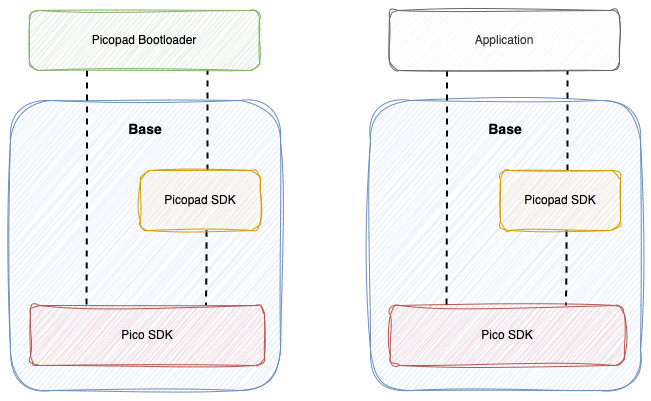
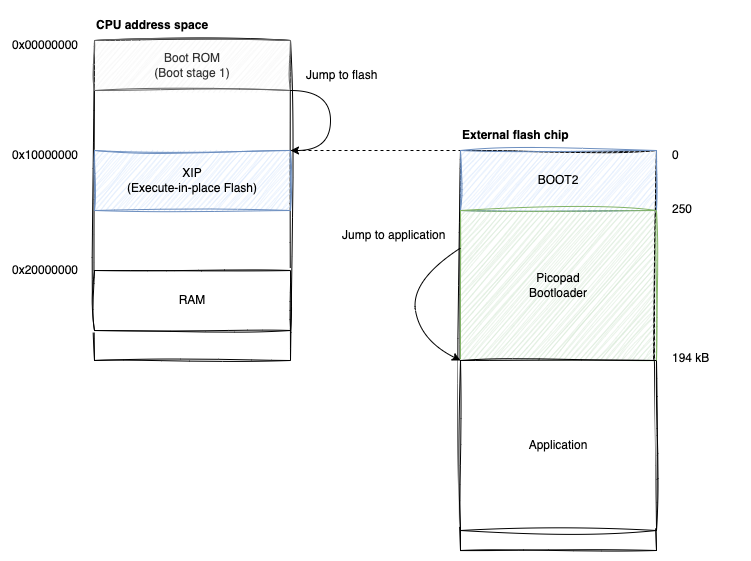

# Picopad SDK Pico SDK Fork

**⚠️ WARNING ⚠️**

This is an alpha version. Any modifications or changes to your Picopad are made at your own risk.

This repository contains a fork of the Picopad SDK, built on the Pico SDK. The goal was to add the capability to use
libraries for the Pico SDK on the Picopad. The project is divided into three parts:

- Picopad bootloader
- Picopad base
- Programs



## Picopad bootloader

This is a custom bootloader for the Picopad. It's loaded through the BOOTSEL mode and enables loading of applications
onto the Picopad from an SD card via a forked version of the original file manager. The first 194 KB is reserved on
flash for this bootloader, and all programs are loaded from the address XIP_BASE + 0x31000.

Most of the code is taken from the Picopad SDK. I replaced some calls with interface calls in the Pico SDK.


### Controls

**Volume Control:**
- Up Arrow: Increases volume
- Down Arrow: Decreases volume

**Backlight Control:**
- Left Arrow: Decreases backlight level
- Right Arrow: Increases backlight level

**Other Controls:**
- Y: Switches Picopad to BOOTSEL
- X: Displays battery and system information
- B: Opens file manager for loading programs from the SD card to the Picopad
- A: Runs the currently loaded application

### Build

- CMAKE is used for the build
- You need to edit the paths in the CMakeLists.txt to:

```
set(PICO_TOOLCHAIN_PATH /Applications/ARM)
set(PICO_SDK_PATH ../../pico-sdk)
set(PICOPAD_BASE_PATH ../../picopad-base)
```

### How to load the Picopad bootloader:

- Switch Pico to BOOTSEL mode
- Load picopad-bootloader.uf2 into Pico
- If you want to use the functionality for saving the configuration to an SD card, copy the file picopad.cfg to the root
  of the SD card you will use in Picopad

### Main changes compared to the original SDK:

- Pico SDK is used for communication with Pico HW
- You can set the volume and backlight level
- Load and save the current configuration on the SD card. Volume and brightness settings persist even after turning off
  the Picopad and are loaded from the SD card at startup
- Quick transition to BOOTSEL mode without the need to press the button on the bottom of the Picopad
- Programs are uploaded to flash only after the Picopad bootloader

## Picopad base

This part contains code with a modified original SDK. It allows you to easily use the Picopad SDK in your programs.

## Programs

These use a modified memory layout without the attached BOOT2 region. Never load programs directly through BOOTSEL into
Picopad/Pico. This will lead to your Picopad getting bricked. The build result is a BIN file with the extension PP2,
which is meant to be uploaded to the SD card and loaded via the Picopad bootloader.



## Links

- Picopad from Pajenicko e-shop
- Picopad SDK (https://github.com/Pajenicko/Picopad)
