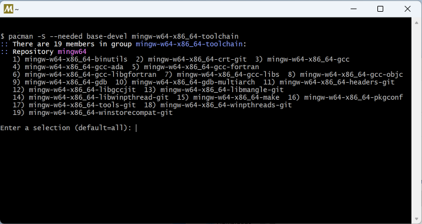
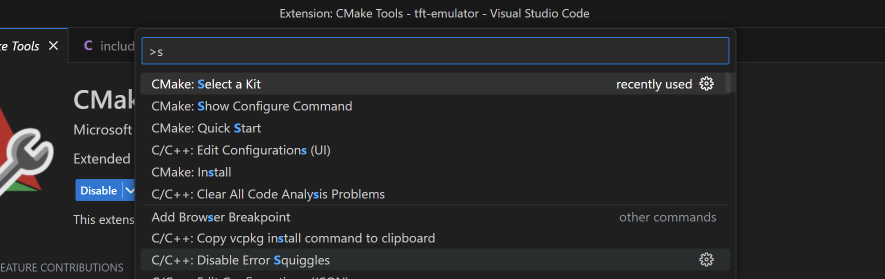

# Picopad TFT Display Emulator

This project provides an emulator for the TFT display of Picopad handheld devices. It's designed to assist in the
prototyping and development of applications for Picopad handhelds. With this tool, you can easily prepare and test your
display code using the API of the Picopad SDK.

Code of this emulator is based on the original Picopad SDK source code.

## Features

- Display emulation: The emulator accurately represents the display characteristics of Picopad handhelds, allowing you
  to see how your application will look on the actual device.
- Keyboard input: Simulate changes in device state with keypress events (e.g., toggle sensor connection with the 'C'
  key).
- Easy prototyping: Modify the provided main file to draw different UI components on the display.
- Picopad SDK API: The emulator is built to interact with the Picopad SDK API, letting you test how your code interacts
  with the API.

## Getting Started

### Prerequisites

This emulator is based on SFML (Simple and Fast Multimedia Library) and the Picopad SDK. Ensure you have SFML on your
system.

Certainly. Here's how you can install SFML on macOS and use it in your project with CMake.

### Installing SFML on macOS

1. Install Homebrew if you don't have it installed already. You can install it by pasting the following command in the
   terminal:

    ```bash
    /bin/bash -c "$(curl -fsSL https://raw.githubusercontent.com/Homebrew/install/HEAD/install.sh)"
    ```

2. Once Homebrew is installed, you can install SFML by running the following command:

    ```bash
    brew install sfml
    ```

This will download and install the latest version of SFML on your system.

### Using SFML in your project with CMake

1. Create a `CMakeLists.txt` file in your project directory if you don't have one already.

2. Add the following lines to your `CMakeLists.txt` file:

    ```cmake
    cmake_minimum_required(VERSION 3.25)
    project(<your_project_name> C CXX)
    
    set(CMAKE_CXX_STANDARD 17)
    
    add_executable(tft-emulator main.cpp)
    
    find_package(SFML 2.5 COMPONENTS graphics audio REQUIRED)
    
    target_link_libraries(tft-emulator sfml-graphics sfml-audio)
    ```

Replace `your_project_name` with the name of your project.

3. In the terminal, navigate to your project directory and build your project with CMake:

    ```bash
    mkdir build
    cd build
    cmake ..
    make
    ```

Your project should now be able to use SFML.

## Running the Emulator

1. Clone this repository to your local machine.
2. Navigate to the project's directory.
3. Compile the source code with your CMAKE.

## Usage

Modify the `main.cpp` file to create the UI of your application using the Picopad SDK API.

## Links

- Picopad from Pajenicko e-shop
- Picopad SDK (https://github.com/Pajenicko/Picopad)

## Setting up CMake Build for TFT Emulator with SFML on Windows using Visual Studio Code

This guide is aimed at Windows users who wish to set up a development environment using Visual Studio Code and CMake for
building a TFT emulator with the Simple and Fast Multimedia Library (SFML). It will guide you through the installation
and configuration process.

## Prerequisites

Ensure you have the following installed on your system:

- [Visual Studio Code](https://code.visualstudio.com/)
- [MSYS2](https://www.msys2.org/)

## Step 1: Installation and Configuration of MSYS2

Download and install MSYS2 from the [MSYS2 website](https://www.msys2.org/). At the end of the installation, you will
be prompted whether you want to run MSYS2 now. Please check this option (Run MSYS2 now).


## Step 2: Install Necessary Tools via MSYS2 Terminal

In the opened terminal, insert the following command:

```shell
pacman -S --needed base-devel mingw-w64-x86_64-toolchain
```

You will see `Enter a selection (default=all):`. Please press enter.



After the installation, add Mingw into your system path:

- In the Windows search bar, type 'settings' to open your Windows Settings.
- Search for 'Edit environment variables for your account'.
- Choose the `Path` variable in your User variables, then select `Edit`.
- Select `New` and add the Mingw-w64 destination folder path to the system path. The exact path depends on which
  version of Mingw-w64 you have installed and where you installed it. If you used the settings above to install
  Mingw-w64, then add this to the path: `C:\msys64\mingw64\bin`.


## Step 3: Download and Install SFML

- Download SFML from the [SFML website](https://www.sfml-dev.org/download/sfml/2.6.0/). Please make sure to choose the
  version: **GCC 13.1.0 MinGW (SEH) - 64-bit**.
- Extract it to a directory of your choice.

## Step 4: Set Up Visual Studio Code

- If not already installed, download and install Visual Studio Code from [here](https://code.visualstudio.com/).
- Install the following plugins for Visual Studio Code:

[C/C++ - Visual Studio Marketplace](https://marketplace.visualstudio.com/items?itemName=ms-vscode.cpptools)


[CMake Tools - Visual Studio Marketplace](https://marketplace.visualstudio.com/items?itemName=ms-vscode.cmake-tools)


## Step 5: Setting Up the Build System in Visual Studio Code

- Press `CTRL + SHIFT + P` - Enter: `CMake: Select a Kit`.



- Then choose `Scan for kits`, Visual Studio should automatically find the Mingw installation.
- After scanning, enter `CMake: Select a Kit` again.
- Choose `GCC 13.1.0 x86_64-w64-mingw32 (mingw64)`.


- In the `CMakeLists.txt` file, uncomment these two lines:

```CMake
    set(SFML_STATIC_LIBRARIES TRUE)
    set(SFML_DIR "c:/picopad/SFML-2.6.0/lib/cmake/SFML")
```

- Modify the path to SFML as needed.
- Press `CTRL + SHIFT + P`, enter `CMake: Delete cache and Reconfigure`.
- To build the test program, you just need to press `CTRL + SHIFT + P`, `CMake: Build Target` to build the
  application.

Now you are ready to develop your TFT emulator with SFML using CMake build in Visual Studio Code on Windows!